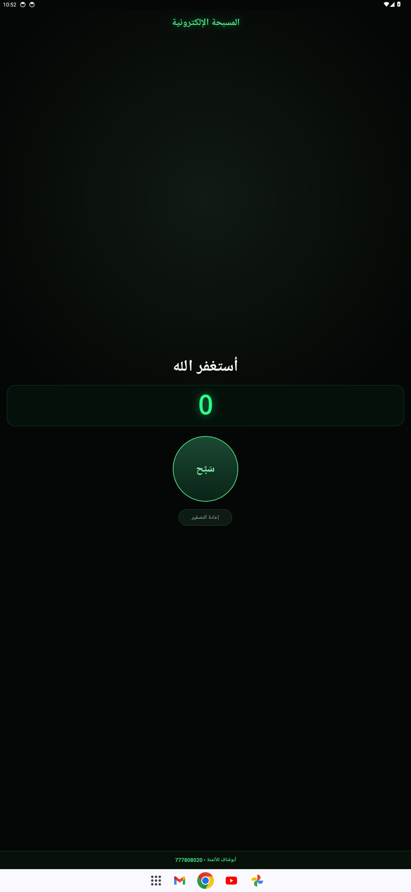
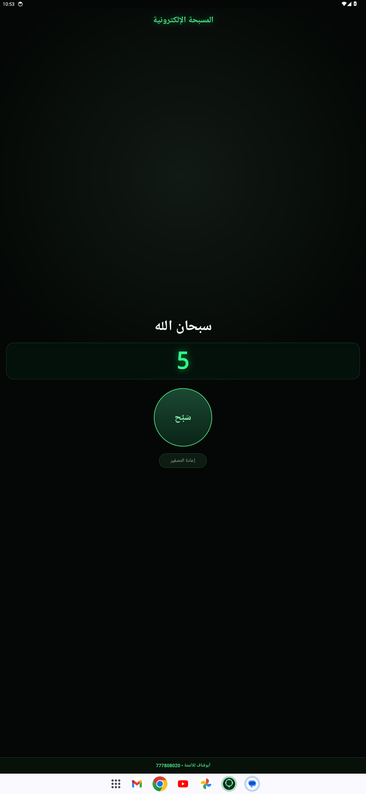
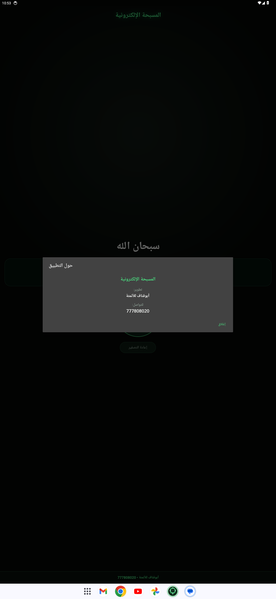

# المسبحة الإلكترونية

تطبيق أندرويد حقيقي بسيط وسريع لعدّ الأذكار، يعمل بالكامل **بدون إنترنت** و**بدون تسجيل دخول** و**بدون إعلانات** و**بدون أي صلاحيات**.

## لقطات حقيقية من تشغيل التطبيق على إيموليتور أندرويد

| الشاشة الرئيسية | بعد 5 ضغطات | نافذة "حول التطبيق" |
| --- | --- | --- |
|  |  |  |

- اسم الحزمة: `com.abognaf.misbaha`
- اللغة: عربية RTL بالكامل.
- التصميم: خلفية سوداء داكنة فخمة، عنوان واحد أعلى الشاشة "المسبحة الإلكترونية"، الذكر الحالي بخط كبير في المنتصف، شاشة عداد كبيرة بشكل شاشة المسبحة الإلكترونية (رقم LED أخضر)، زر دائري كبير جدًا للعد، وزر صغير لإعادة التصفير.
- شريط أخضر ثابت أسفل الشاشة دائمًا: `أبوقناف للأتمتة • 777808020` — يظهر في كل لقطات أعلاه.

## سلوك العدّ
1. أستغفر الله ← 2. سبحان الله ← 3. الحمد لله ← 4. والله أكبر ← (يعود إلى 1)

- كل ضغطة على الزر الدائري تزيد العداد بمقدار 1 وتنقل الذكر إلى التالي (بدون أي اهتزاز).
- **لا** يُصفَّر العدد عند الانتقال بين الأذكار.
- زر "إعادة التصفير" هو **الوحيد** الذي يعيد العدد إلى صفر.

## الحفظ
- يُحفظ العدد (وموضع الذكر) محليًا على الهاتف (SharedPreferences).
- عند إغلاق التطبيق وفتحه مرة أخرى يستمر من نفس العدد.

## الشريط الثابت
- شريط **ثابت ظاهر دائمًا** أسفل الشاشة (Bottom Bar لا يحتاج تمرير ولا يُغطى):
  `أبوقناف للأتمتة • 777808020` باللون الأخضر.
- الضغط عليه يفتح نافذة "حول التطبيق" مع زر "إغلاق".

## البناء محليًا
يتطلب JDK 17 وأندرويد سdk (platform 35):

```bash
cd misbaha
gradle :app:assembleDebug
# الناتج:
# misbaha/app/build/outputs/apk/debug/app-debug.apk
```

## البناء التلقائي (GitHub Actions)
السير `‎.github/workflows/misbaha-build.yml‎` يعمل تلقائيًا عند أي تغيير في `misbaha/`:

| Job | النتيجة |
| --- | --- |
| `apk` | يبني الـ APK ثم يرفعه كـ Artifact باسم **`Misbaha-APK`** |
| `tests` | اختبارات Robolectric تحقّق فعلًا من ظهور الشريط الثابت بنصّه الحرفي وطبقة التخطيط، ومن منطق العدّ والحفظ |
| `screenshots` | يشغّل التطبيق على ميموليتور حقيقي ويلتقط لقطات (الشاشة الرئيسية، بعد 5 ضغطات، ونافذة حول التطبيق) ويرفعها كـ Artifact باسم `Misbaha-Screenshots` |

سحب الـ APK: صفحة Actions → تشغيل workflow → Artifact باسم `Misbaha-APK`.

## الاختبارات
```bash
cd misbaha
gradle :app:testDebugUnitTest
```
